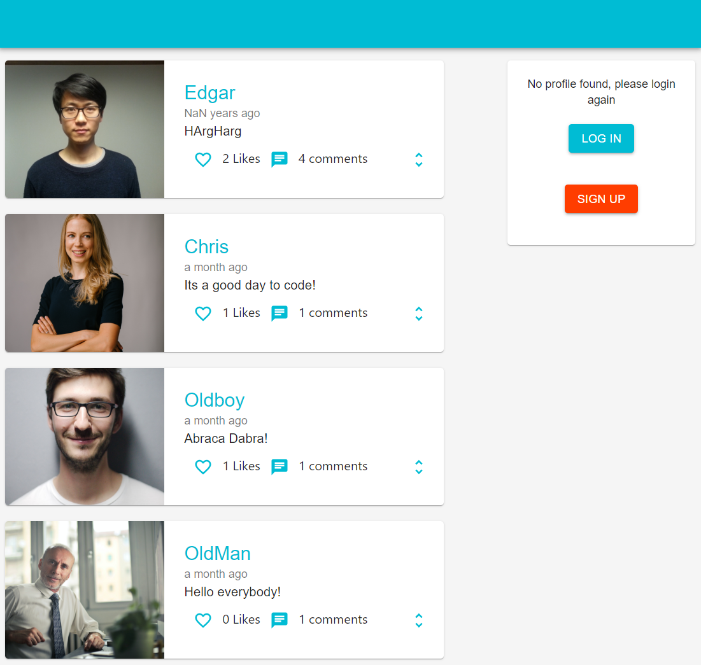
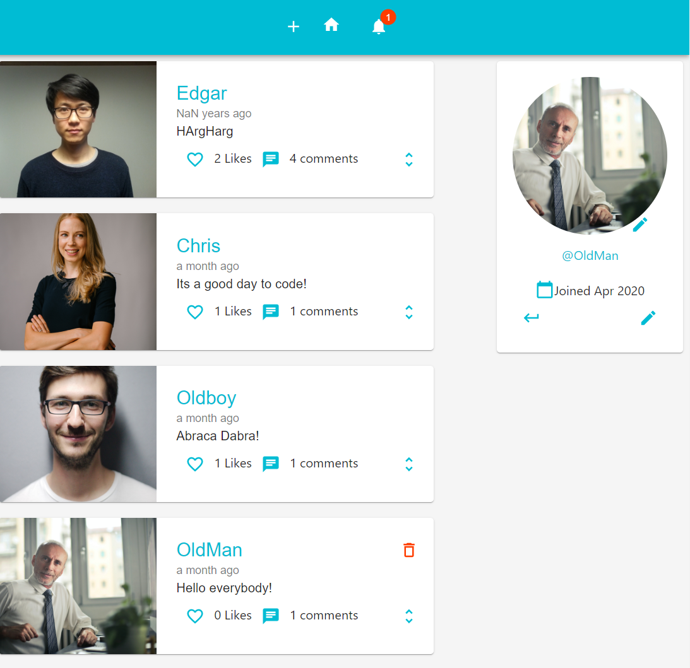
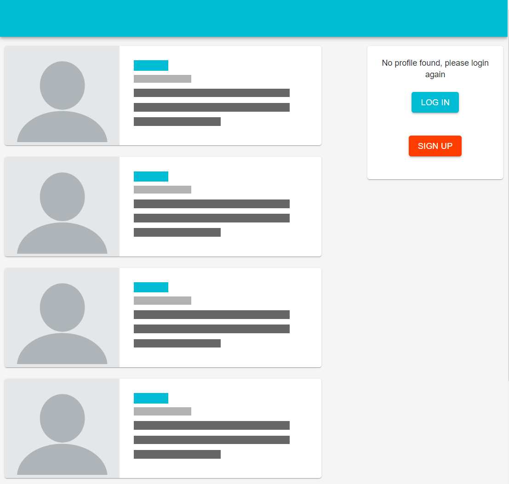

# SocialMediaClient

Twitter like Web application with

> Click <a href="https://social-client-e3887.web.app/" target="_blank">`HERE`</a> to check it out right now.

## Preview

> While loading
> 

## Language / Framework

> Front-end

- Javascript / HTML / CSS
- React / Redux

> Backend / Database / Deployment

- Firebase

---

## Features

- Twitter clone
- Realtime notification on Likes, replys on ones comments.

---

## Live Demo

> Click <a href="https://quirky-mclean-4493ba.netlify.com/" target="_blank">`HERE`</a> to check it out right now.

---
